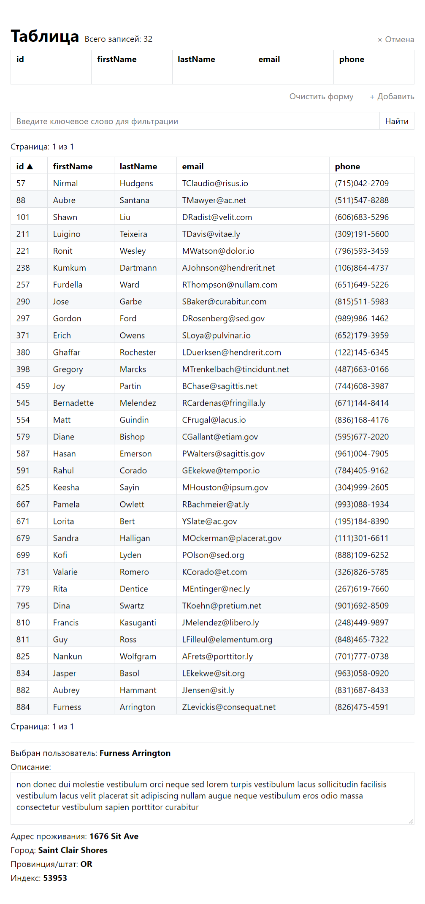

# Тестовое задание на позицию frontend разработчика

### Задание

Необходимо разработать React-приложение для отображения таблицы с данными. Дополнительным плюсом будет: Финальный билд приложения должен быть запускаться из **Docker контейнера** (хотябы с минимальной конфигурацией)

**Функционал**

- Сортировка по столбцам: при нажатии на название столбца строки таблицы сортируются по возрастанию, при повторном клике — по убыванию. Графическим элементом или текстовым сообщением указывается направление сортировки.

- Клиентская пагинация: данные необходимо отображать постранично, максимум 50 элементов на страницу. Необходимо предоставить пользовательскую навигацию для перехода по страницам.

- Фильтрация: компонент предоставляет текстовое поле, в которое пользователь может ввести текст и строки таблицы, данные которых не содержат подстроку, введённую пользователем, скрываются. Перефильтрация осуществляется по нажатию на кнопку "Найти".

- По клике на строку таблицы значения полей выводятся в дополнительном блоке под таблицей.

- Данные в таблицу загружаются с сервера. Способ загрузки с сервера на ваш выбор.

- Над таблицей присутсвует кнопка **добавить**, по нажатии на которую выпадает форма добавления ряда 

	| id    | firstName | lastName | email | phone |
	| ----- | --------- | -------- | ----- | ----- |
	| input | input     | input    | input | input |

- После заполнения всех инпутов активируется кнопка **Добавить в таблицу** которая вставляет заполненный ряд в начало таблицы

### Что было реализовано

- [x] Сортировка по столбцам: при нажатии на название столбца строки таблицы сортируются по возрастанию, при повторном клике — по убыванию. Графическим элементом или текстовым сообщением указывается направление сортировки.
- [x]  Клиентская пагинация: данные необходимо отображать постранично, максимум 50 элементов на страницу. Необходимо предоставить пользовательскую навигацию для перехода по страницам.
- [x] Фильтрация: компонент предоставляет текстовое поле, в которое пользователь может ввести текст и строки таблицы, данные которых не содержат подстроку, введённую пользователем, скрываются. Перефильтрация осуществляется по нажатию на кнопку "Найти".
- [x] По клике на строку таблицы значения полей выводятся в дополнительном блоке под таблицей.
- [x] Данные в таблицу загружаются с сервера. Способ загрузки с сервера на ваш выбор.
- [x] Над таблицей присутсвует кнопка **добавить**, по нажатии на которую выпадает форма добавления ряда 

| id    | firstName | lastName | email | phone                                                        |
| ----- | --------- | -------- | ----- | ------------------------------------------------------------ |
| input | input     | input    | input | inputПосле заполнения всех инпутов активируется кнопка **Добавить в таблицу** которая вставляет заполненный ряд в начало таблицы |

### Внешний вид

